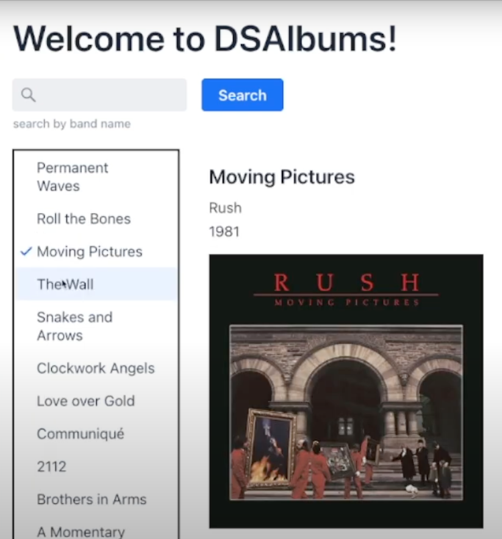

# DSAlbums
An implementation of the Java client for the Data API, using a dataset of music albums. This is a companion repository for the "[Using the Data API on HCD](https://www.youtube.com/watch?v=LbcsVfm4A-k)" video on the [DataStax Developers](https://www.youtube.com/@DataStaxDevs) YouTube channel.

## Known issues
 - Menu resizes horizontally based on the contents.

## Requirements

 - Java 21 (JRE)
 - Environment variables
     - `DB_API_ENDPOINT`
     - `DB_APPLICATION_TOKEN`
 - A database which supports the DataStax Data API:
    -Astra DB
    -DSE 6.9
    -HCD 1.0

## Database Schema
DSAlbums expects a collection named "albums" to exist in the "default_keyspace" namespace. The `albums` collection is expected to contain four properties:
 - `_id`: An autogenerated (type-4) UUID to act as a unique identifier for each album.
 - `title`: The album's title.
 - `band`: The musical group who composed the album.
 - `year`: The year that the album was released.

## To build:

### Build Requirements

 - Maven

The [pom.xml](pom.xml) file can be adjusted to build with earlier versions of Java, but it is not recommended to go below 17.

### Build command

    mvn clean install

### Running the build

    java -jar target/dsalbums-0.0.1-SNAPSHOT-jar-with-dependencies.jar
